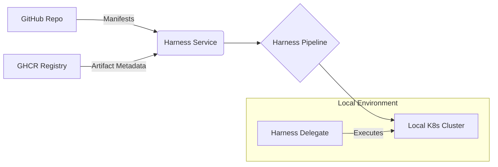

# Harness CD with GHCR on Local Kubernetes

### Artifact-Centric Deployment Guide

---

## 📖 Overview

This repository contains the practical, end-to-end guide for deploying containerized applications to a local Kubernetes cluster using **Harness Continuous Delivery** and **GitHub Container Registry (GHCR)**.

The focus of this guide is resolving the "integration gaps" where authentication fails, artifacts aren't visible, or manifests render empty.

---

## 🏗 Architecture & Workflow

### The Delivery Contract

In a robust CI/CD system, the handoff between CI and CD is an immutable contract. CI produces the artifact (Docker Image); CD ensures that exact version is deployed.

### Deployment Logic

The following diagram illustrates how Harness connects your GitHub source, GHCR registry, and Local Cluster.

---

## 🚀 Step-by-Step Implementation

### 1. Registry Connection

You must authenticate Harness with GHCR using a GitHub Personal Access Token (PAT) with `read:packages` scope.

* **Registry URL:** `https://ghcr.io`
* **Authentication:** GitHub Username + PAT (Secret)
* **Connectivity:** Must route through the local **Harness Delegate**.

### 2. Service & Artifact Definition

The Service links your YAML to your Image. **Critical:** Do not hardcode tags in your manifests. Use the Harness variable expression:

> `image: <+artifact.image>`

### 3. Pipeline Configuration

Configure your pipeline to use **Runtime Input** for the artifact tag. This allows you to select specific versions from the GHCR registry at execution time.

| Step | Action | Outcome |
| --- | --- | --- |
| **Pick Tag** | Select from GHCR list | Immutable deployment |
| **Fetch Manifest** | Pull from GitHub path | Clean YAML resolution |
| **Apply** | `kubectl apply` via Delegate | Running Pods |

---

## 🛠 Troubleshooting Common Gaps

### "No objects passed to apply"

* **Cause:** The folder path in the Harness Service Manifest configuration does not match the GitHub repository structure exactly.
* **Fix:** Ensure the path points to the directory containing your `.yaml` files, not the files themselves.

### "Failed to fetch artifacts"

* **Cause:** Harness cannot resolve the image path.
* **Fix:** In the Artifact Source settings, ensure the **Image Path** does *not* include the registry prefix (e.g., use `username/image`, not `ghcr.io/username/image`).

---

## 📝 Core Deployment Principles

1. **Immutability:** Always deploy by Digest or specific Tag, never use `latest`.
2. **Locality:** Always validate manifests locally using `kubectl apply --dry-run=client` before pushing to Git.
3. **Strict Contracts:** CD should never "guess" what to deploy; the artifact must be explicitly defined in the Service.

---

## 👥 Maintainers

* **Owner:** Shailesh Rawat
* **Last Reviewed:** 2026-01-22

---
