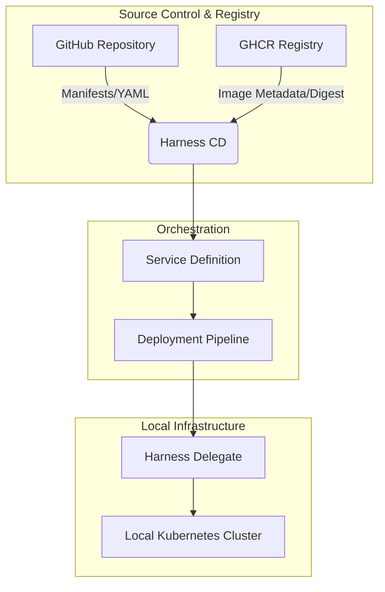

# Harness CD with GHCR on Local Kubernetes: Artifact-Centric Deployment Guide

| Metadata | Specification |
| --- | --- |
| **Document Type** | Technical Standard Operating Procedure (SOP) |
| **Status** | Stable |
| **Version** | 1.0.0 |
| **Owner** | Shailesh Rawat |
| **Maintainer** | Shailesh Rawat |
| **Last Reviewed** | 2026-01-22 |
| **Classification** | Internal Technical Documentation |

---

## Executive Summary

This document provides a standardized framework for deploying containerized applications to local Kubernetes environments using **Harness Continuous Delivery (CD)** and **GitHub Container Registry (GHCR)**.

The primary objective is to eliminate integration friction by establishing a strict **Artifact-to-Manifest Contract**. This ensures that deployments are immutable, traceable, and reproducible, moving away from brittle manual configurations.

---

## Technical Architecture

### Deployment Logic Flow

---

## Prerequisites

### System Requirements

* **Kubernetes Cluster:** A functional local cluster (Docker Desktop, k3s, or kind).
* **Control Plane:** `kubectl` CLI configured to the local context.
* **Harness Agent:** A Kubernetes Delegate must be installed and "Connected" within the target cluster.

### Access & Security

* **GitHub Personal Access Token (PAT):** Required with `read:packages` scope.
* **Harness Secrets:** The PAT must be stored in the Harness Built-in Secret Manager.

---

## Configuration Specifications

### 1. Docker Registry Connector (GHCR)

To establish a secure handshake with GHCR, configure the connector with the following parameters:

| Parameter | Value |
| --- | --- |
| **Provider** | Other (Docker V2) |
| **Registry URL** | `https://ghcr.io` |
| **Authentication** | Manual (Username + Password/PAT) |
| **Connectivity** | Through Delegate |

### 2. Service Definition (The Artifact Contract)

The Harness Service acts as the logical wrapper for the application.

* **Artifact Source:**
* **Type:** Docker Registry.
* **Image Path:** `<username>/<image-name>` (Note: Exclude the `ghcr.io/` prefix).
* **Tag:** Use `<+input>` for runtime flexibility or a specific version for pinning.

* **Manifests:**
* **Store:** Remote (GitHub).
* **Path:** The specific subdirectory containing Kubernetes YAMLs.

> **Critical Standard:** Manifests must utilize the Harness expression `image: <+artifact.image>` to allow the CD engine to inject the immutable image digest at runtime.

---

## Implementation Workflow

### Phase 1: Local Validation

Before initiating the pipeline, validate the manifests locally to ensure schema compliance:

1. Run `kubectl apply --dry-run=client -f k8s/deployment.yaml`.
2. Confirm the output is `deployment.apps/... reaching dry-run`.

### Phase 2: Pipeline Execution

1. Select the **Deploy** stage within the Harness Pipeline.
2. Link the **Service** and **Environment** (Local Infrastructure).
3. At execution, select the specific artifact tag fetched from GHCR.
4. Monitor the **Deployment Stepping** logs to ensure the Rolling Update reaches a steady state.

---

## Troubleshooting Matrix

| Symptom | Probable Cause | Corrective Action |
| --- | --- | --- |
| **Authentication Failure (401/403)** | Invalid PAT or insufficient scopes. | Verify `read:packages` scope; ensure PAT is updated in Harness Secrets. |
| **Empty Manifest Rendering** | Incorrect GitHub folder path. | Validate the path in Service settings; ensure it points to the folder, not the file. |
| **ImagePullBackOff** | Delegate lacks pull secrets for GHCR. | Ensure the Service defines a `github-pull-secret` if the cluster is not pre-authenticated. |
| **No Objects Passed to Apply** | YAML syntax or indentation error. | Use a standard YAML linter or verify with `kubectl --dry-run`. |

---

## Governance and Best Practices

* **Immutability:** Never hardcode image tags (especially `latest`) in deployment manifests.
* **Auditability:** Always use the Harness Execution UI to verify which SHA256 digest was deployed to the cluster.
* **Validation:** All manifests should undergo `dry-run` validation in the CI stage before being processed by the CD stage.

---

## Maintenance and Support

For updates to this SOP or technical escalations:

* **Maintainer:** Shailesh Rawat
* **Documentation Archetype:** Technical-Documentation (Status: Stable)

---
