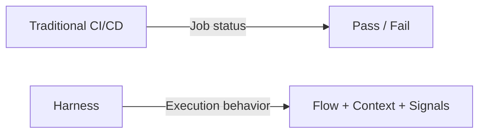
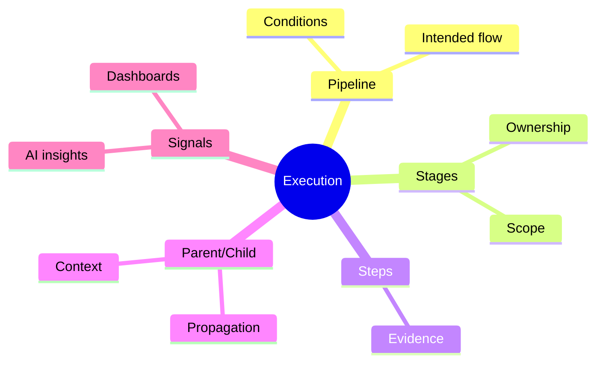
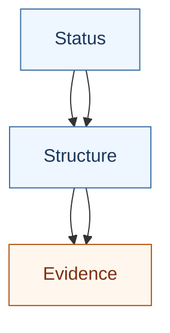

The Harness Mental Model
========================

How to think about pipelines, executions, signals, and responsibility in
Harness.

Why This Document Exists
------------------------

Teams often struggle with Harness not because it is complex, but because they
approach it with the wrong mental model.

If you treat Harness like a traditional CI/CD tool, you will:

- Miss **context**.
- Overuse **logs**.
- Underuse **signals**.
- Fail to reduce **MTTR**.

This document explains how Harness expects you to think about **pipelines**,
**executions**, and **failures**.

Who This Is For
--------------

Primary:

- DevOps and Platform teams operating Harness.

Secondary:

- Engineers responding to pipeline failures.

This document is foundational. All other docs in this repository build on it.

The Core Shift: From Jobs to Behavior
-------------------------------------

Traditional CI/CD tools condition teams to think:

> A job ran. It passed or failed.

Harness is designed around a different idea:

> A system behaved a certain way during an execution.

This shift matters. Harness optimizes for:

- Understanding **flow**, not just outcome.
- Seeing **context**, not just logs.
- Identifying **patterns**, not just incidents.

Diagram: Mental Model Shift
---------------------------

Key Objects in Harness (Conceptual)
-----------------------------------

This is not a feature list. These are **thinking units**.

Pipeline
~~~~~~~~

A pipeline describes **intended flow**, not guaranteed outcome.

Think of a pipeline as:

- A map of possible execution paths.
- A set of conditions and dependencies.
- A contract for how work should progress.

Pipelines do not fail. **Executions do.**

Execution (Run)
~~~~~~~~~~~~~~~

An execution is a **single instance of pipeline behavior**. This is where:

- **Time** matters.
- **Context** emerges.
- **Failures** become visible.

An execution answers:

- What actually ran?
- In what order?
- Under what conditions?
- Where did behavior deviate?

Most triage should start here.

Stage and Step
~~~~~~~~~~~~~~

Stages and steps are **scoping mechanisms**, not just grouping. They tell you:

- Where responsibility is likely owned.
- Which part of the system was active.
- What downstream impact to expect.

When something fails, the **first failing stage** usually matters more than the
last.

Parent and Child Pipelines
~~~~~~~~~~~~~~~~~~~~~~~~~~

Harness supports pipelines that trigger other pipelines. This introduces an
important concept:

> Failures can **propagate**, not just occur.

A child pipeline failure may:

- Be the root cause.
- Be a downstream symptom.
- Be expected and handled.

Understanding this relationship is critical for correct triage.

Diagram: Execution Context Map
------------------------------

How Harness Surfaces Information (By Design)
--------------------------------------------

Harness does not surface information randomly. It follows a loose priority
order.

1. Status (Fast, Shallow)
~~~~~~~~~~~~~~~~~~~~~~~~~

Status answers:

- Did something complete?
- Is attention required?

Status is for **orientation**, not diagnosis.

2. Structure (Fast, Contextual)
~~~~~~~~~~~~~~~~~~~~~~~~~~~~~~~

The execution graph answers:

- Where did flow break?
- What was skipped?
- What ran in parallel?
- What was gated?

This is the **primary triage surface**.

3. Evidence (Slow, Detailed)
~~~~~~~~~~~~~~~~~~~~~~~~~~~~

Logs, error messages, and artifacts answer:

- What exactly happened?
- Why did a step fail?

Evidence is for **confirmation**, not discovery. Teams that skip structure and
jump straight to evidence usually take longer to resolve issues.

Diagram: Information Hierarchy
------------------------------

Signals vs Decisions
--------------------

Harness increasingly surfaces:

- Dashboards.
- Metrics.
- AI-assisted insights.
- Anomalies.

These are **signals**, not decisions.

Signals:

- Point attention.
- Highlight patterns.
- Suggest correlation.

They do not:

- Assign blame.
- Declare root cause.
- Replace human judgment.

Treating signals as decisions creates false confidence.

Responsibility Boundaries
-------------------------

Harness intentionally separates concerns:

- The platform surfaces behavior.
- Engineers interpret and act.
- Humans remain accountable.

If you find yourself asking:

> Why did not Harness stop this?

You are asking the wrong question. The correct question is:

> What signal did we miss, or misinterpret?

What Good Usage Looks Like
--------------------------

Teams are using Harness well when:

- They start triage from execution structure.
- They identify the first failing stage quickly.
- They use summaries before logs.
- They escalate with context, not screenshots.
- They treat AI insights as guidance, not authority.

Common Mental Model Mistakes
----------------------------

Avoid these patterns:

- Treating pipelines as linear jobs.
- Treating every red stage as root cause.
- Treating dashboards as explanations.
- Treating AI insights as conclusions.

These slow teams down.

Why This Mental Model Matters
-----------------------------

Harness does not automatically improve reliability. Reliability improves when
teams:

- Interpret behavior correctly.
- Make better triage decisions.
- Reduce unnecessary investigation.
- Escalate with clarity.

This mental model is the foundation for doing that.

What Comes Next
--------------

Continue with:

- `docs/02-pipeline-execution-and-visibility.md`
- `docs/03-parent-child-pipelines.md`
- `docs/04-understanding-failures.md`

Each document deepens one part of this model.

Final Note
----------

Harness gives you **better signals**. It is your understanding, not the tool,
that turns signals into outcomes.
